# DrumSynth

A 3-voice drum synthesizer built on Teensy 4.0.

## Hardware

- **MCU:** Teensy 4.0 (ARM Cortex-M7 @ 600MHz)
- **Audio:** Teensy Audio Library → on-board DAC
- **Display:** 128x64 SH1106 OLED (software SPI) with oscilloscope waveform view
- **Controls:** 32 knobs (2x 16-ch analog mux), 16 step buttons, 10 control buttons
- **LEDs:** 16 step LEDs (74HC595 shift register)
- **Clock:** Internal BPM (60-1000) with external pulse sync on pin 12
- **Storage:** 10 EEPROM pattern save/load slots

## Voices

| Voice | Type | Description |
|-------|------|-------------|
| **D1** | Kick | FM synthesis — 3 modulated oscillators + SimpleDrum, pitch envelope, wavefolder |
| **D2** | Snare/Clap | Dual noise channels with filters and delays, crossfadable snare-to-clap mix |
| **D3** | Hi-Hat | 3 selectable modes: 606-style (6-osc bank), FM hats, noise-based |

## OLED Interface

128x64 monochrome OLED showing real-time oscilloscope, status bar, parameter overlays, and voice selection rails.

### Main View
| Stopped | Playing (D1 Kick) |
|---------|-------------------|
| 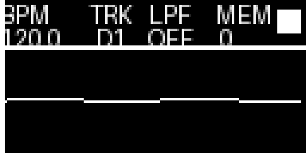 | 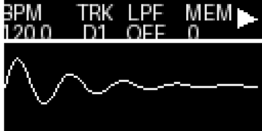 |

| Playing (D2 Snare) | Playing (D3 Hat) |
|---------------------|------------------|
| 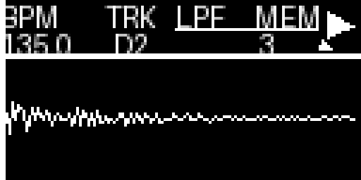 | 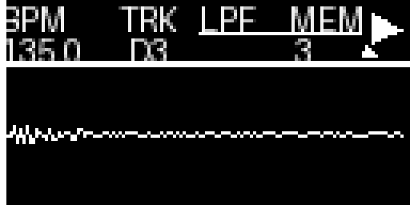 |

### Parameter Overlays
Appear for 500ms when a knob is turned, overlaid on the waveform with outlined text.

| D1 Decay | Master Volume | Wavefold Intensity |
|----------|---------------|-------------------|
| 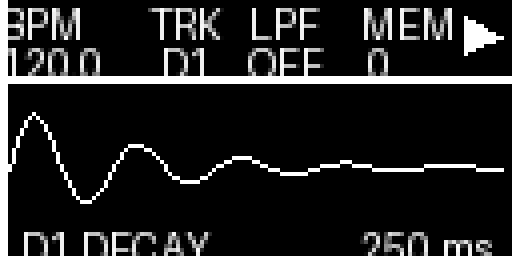 | 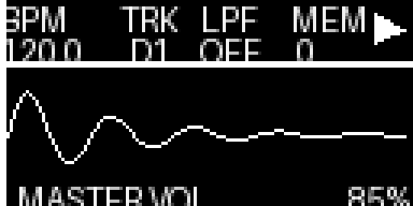 | 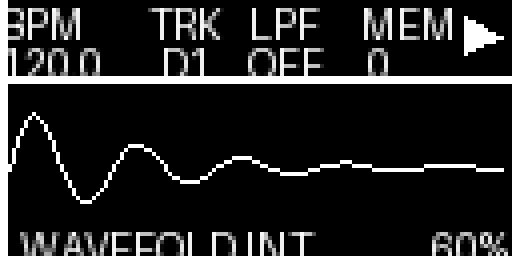 |

### Voice Selection Rails
Slider-style selectors with caret indicator and outlined labels.

| D1 Shape (SIN/SAW/SQR) | D2 Voice (CLAP/SNARE) | D3 Voice (1/2/3) |
|-------------------------|----------------------|-------------------|
| 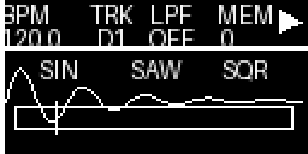 | 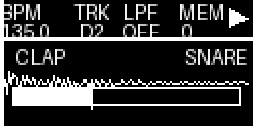 | 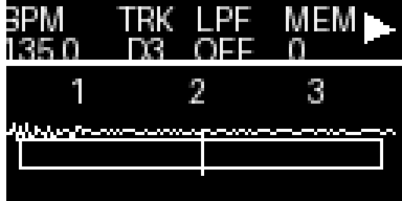 |

### Other Screens
| External Clock | LPF Active | Pattern Saved |
|----------------|------------|---------------|
| 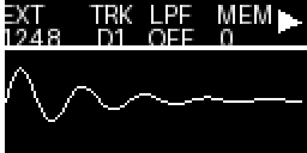 | 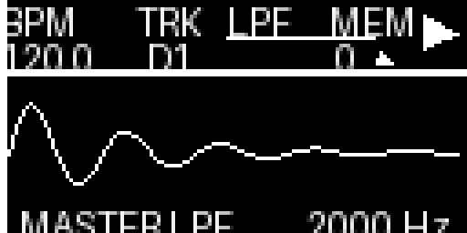 | 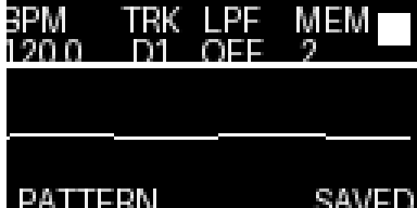 |

| Boot Splash | PPQN Selection |
|-------------|----------------|
| 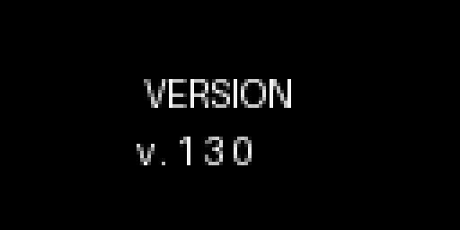 | 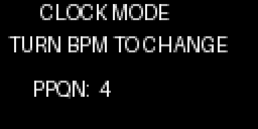 |

## Features

- 16-step sequencer with play/stop transport
- 13 accent pattern modes
- D2/D3 choke control (linked decay modulation)
- Master wavefolder with frequency and intensity controls
- Master bandpass filter
- External clock sync with zero-latency ISR triggering and glitch filter
- Real-time oscilloscope waveform on OLED
- Per-voice volume, decay, frequency, and tone controls

## File Structure

| File | Purpose |
|------|---------|
| `DrumSynth.ino` | Main firmware — sequencer, UI, knob handling, display |
| `audiotool.h` | Audio graph (Teensy Audio Design Tool export) |
| `audio_init.h` | Mixer gains, envelope params, filter settings |
| `hw_setup.h` | Pin assignments, mux/LED/OLED hardware config |
| `ext_sync.h` | External clock ISR, glitch filter, lock-in logic |
| `eeprom.h` | Pattern save/load, PPQN persistence |
| `oscilloscope.h` | Scrolling waveform display (decimation, auto-scale) |
| `bitmaps.h` | OLED transport icons (play/stop) |

## Dependencies

- [Teensy Audio Library](https://www.pjrc.com/teensy/td_libs_Audio.html)
- [Mux](https://github.com/stechio/arduino-ad-mux-lib) (analog multiplexer)
- [ResponsiveAnalogRead](https://github.com/dxinteractive/ResponsiveAnalogRead)
- [ShiftRegister74HC595](https://github.com/Simsso/ShiftRegister74HC595)
- [Adafruit GFX](https://github.com/adafruit/Adafruit-GFX-Library) + [Adafruit SH110X](https://github.com/adafruit/Adafruit_SH110x)

## Build

Open in Arduino IDE or compile with arduino-cli:

```bash
arduino-cli compile --fqbn teensy:avr:teensy40 .
arduino-cli upload --fqbn teensy:avr:teensy40 -p /dev/ttyACM0 .
```
